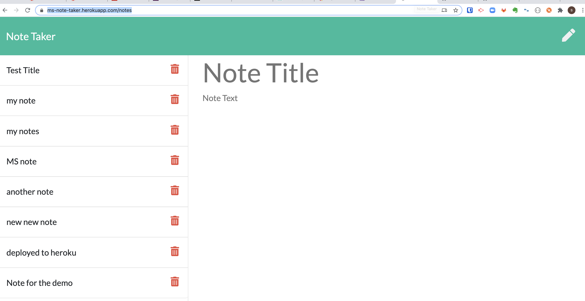

# Note-taker App built using Express.js and node.js
Note taker app is built using express.js backend. It saves and retrieves the notes from JSON file.
App is deployed on the Heroku and code is published on the github.

# Github link 
https://github.com/mukul2016/note-taker

# Deployed on Heroku
https://ms-note-taker.herokuapp.com/notes

# 

